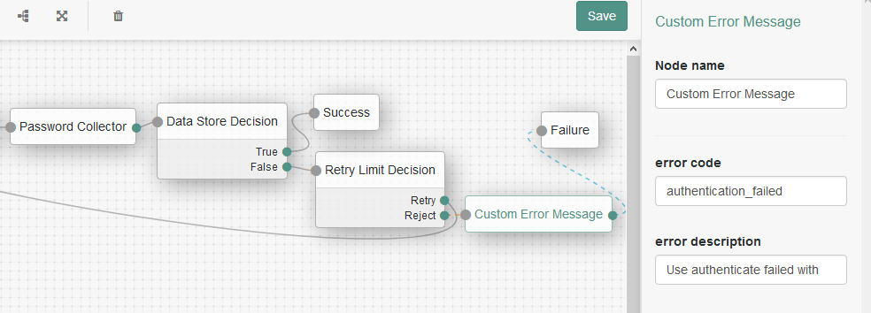

# YES Capabilities

This project contains several classes to assist in setting up AM to be used with a YES.com integration.

## Contents
The following items are included in this project:

- Custom authentication node for use inside an Authentication Tree
- Custom error message node for use inside an Authentication Tree
- Custom scope validator for use inside an OAuth2 Provider
- Custom plugin logic to retrieve Verified Person Data from a remote endpoint
- Custom IG route configuration for use inside OpenIG
- Custom groovy scripts for use inside OpenIG
- Demonstration scripts
- Sample mock services

## Usecases
The artifacts extend AM and IG to perform the following tasks:

- get verified person data from a remote service to return in a userinfo call
- allow dynamic scopes, for example ```https://www.yes.com/scopes/pis:1234566``` where the value after the scope name is a dynamic value
- custom error handling in case of incompatible default errors
- custom error handling in case of incorrect values
- sending mediation records in case of an issued access_token or a userinfo response

# AM Setup
## AM Artifact
Because the official release containing the mTLS setup is not yet released as version 6.5.1, there's also a version of AM included (release candidate 2) which can be found here: [https://github.com/ForgeRock/PSD2-Accelerators/releases/download/v6.5.1-RC2/AM-6.5.1-RC2.war](https://github.com/ForgeRock/PSD2-Accelerators/releases/download/v6.5.1-RC2/AM-6.5.1-RC2.war)

The built JAR is also available in case it's not possible to build it yourself and can be found here: [https://github.com/ForgeRock/PSD2-Accelerators/releases/download/v6.5.1-RC2/yes-openam-extensions-1.0-SNAPSHOT.jar](https://github.com/ForgeRock/PSD2-Accelerators/releases/download/v6.5.1-RC2/yes-openam-extensions-1.0-SNAPSHOT.jar)

## Building (the official way)
Ensure that you have access to the ForgeRock maven repositories. This requires a backstage account which is associated with a ForgeRock subscription.

Detailed instructions for setting up maven repository access can be found here: [https://backstage.forgerock.com/knowledge/kb/article/a74096897](https://backstage.forgerock.com/knowledge/kb/article/a74096897)

Once setup, run maven to build a JAR:
```
 $ mvn clean install
```

Once the build has succeeded, the JAR is in the ```target/``` directory and can be copied to an AM instance for installation.

## Building (against a release candidate)
Section only applies when the official release is not yet there and you'd like to build it after making changes. This is somewhat more tricky since there is no maven repository available but with maven you can add the dependencies to your local maven repository.

There's a script that can be used as inspiration in the ```demo-scripts/``` directory called ```add-local-deps-from-war.sh```.

This script unzips a WAR into a temporary directory and attempts to perform ```mvn install:install-file``` commands for each JAR for which the version, artifactId and groupId can be determined. Not all JARs have this info available so not all dependencies may get installed.

The local build process against a release candidate is temporary until the official release comes out (this section will be removed when this is the case).

## Installation
The JAR that was built needs to be available to the OpenAM instance. Place a copy of the JAR into the unpacked deployed application under your Tomcat's webapps directory, in the ```WEB-INF/lib``` folder. AM will need to be restarted after installation.

## Configuration

### mTLS Setup
This section is included here but is obsolete once the official Forgerock documentation for this feature has been published (expected as part of the 6.5.1 release). In the mean time, this is how to enable mTLS support as per the [draft mTLS spec](https://tools.ietf.org/html/draft-ietf-oauth-mtls-13).

Note: the early access documentation is also available with a valid Backstage account and can be found here: [https://ea.forgerock.com/docs/am/oauth2-guide/index.html#self-signed-mtls](https://ea.forgerock.com/docs/am/oauth2-guide/index.html#self-signed-mtls)

#### Tomcat Setup
In this document we assume that Tomcat is used as the container of choice for the AM deployment. The configuration outlined here also assumes the tomcat-native library to be installed and available in the Tomcat library path.

This example uses self-signed certificates for the setup and assumes that TLS terminates at the AM container. If TLS termination is handled elsewhere, the client certificate should be added to a header in the forwarded request towards AM.

Generating a self-signed server certificate:

```
$ openssl ecparam -name prime256v1 -genkey -noout -out mylocal.key
$ openssl req -new -x509 -key mylocal.key -out mylocal.crt -days 3650 -subj '/CN=name-inside-certificate'
```
This certificate should be made available to Tomcat in for example the ```conf/``` directory.

Then, setup the Tomcat SSL connector with a configuration similar to this:
```
<Connector port="8443" protocol="org.apache.coyote.http11.Http11AprProtocol"
        maxThreads="150" SSLEnabled="true" scheme="https" secure="true">
        <SSLHostConfig certificateVerification="optionalNoCA"
		caCertificateFile="conf/mylocal.crt"
		protocols="TLSv1.2"
		honorCipherOrder="true"
		ciphers="TLS_ECDHE_RSA_WITH_AES_256_GCM_SHA384,TLS_ECDHE_ECDSA_WITH_AES_256_GCM_SHA384,TLS_ECDH_RSA_WITH_AES_256_GCM_SHA384,TLS_ECDH_ECDSA_WITH_AES_256_GCM_SHA384,TLS_ECDHE_RSA_WITH_AES_128_GCM_SHA256,TLS_ECDHE_ECDSA_WITH_AES_128_GCM_SHA256,TLS_ECDH_RSA_WITH_AES_128_GCM_SHA256,TLS_ECDH_ECDSA_WITH_AES_128_GCM_SHA256
,TLS_ECDHE_RSA_WITH_AES_256_CBC_SHA384,TLS_ECDHE_ECDSA_WITH_AES_256_CBC_SHA384,TLS_ECDHE_RSA_WITH_AES_256_CBC_SHA,TLS_ECDHE_ECDSA_WITH_AES_256_CBC_SHA,TLS_ECDH_RSA_WITH_AES_256_CBC_SHA384,TLS_ECDH_ECDSA_WITH_AES_256_CBC_SHA384,TLS_ECDH_RSA_WITH_AES_256_CBC_SHA,TLS_ECDH_ECDSA_WITH_AES_256_CBC_SHA,TLS_ECDHE_RSA_WITH_AES_128_CBC_SHA
256,TLS_ECDHE_ECDSA_WITH_AES_128_CBC_SHA256,TLS_ECDHE_RSA_WITH_AES_128_CBC_SHA,TLS_ECDHE_ECDSA_WITH_AES_128_CBC_SHA,TLS_ECDH_RSA_WITH_AES_128_CBC_SHA256,TLS_ECDH_ECDSA_WITH_AES_128_CBC_SHA256,TLS_ECDH_RSA_WITH_AES_128_CBC_SHA,TLS_ECDH_ECDSA_WITH_AES_128_CBC_SHA">
            <Certificate certificateFile="conf/mylocal.crt"
                certificateKeyFile="conf/mylocal.key"
                certificateKeyPassword="changeit"
                type="EC"/>
        </SSLHostConfig>
    </Connector>
```
Now that the SSL listener is enabled, the OAuth2 client can be configured with the necessary settings.

#### OAuth2 Client Setup For mTLS
The configuration that needs to change in order to use mTLS client authentication are the following:

##### Advanced
Field 'Token Endpoint Authentication Method'. Needs to be set to ```self_signed_client_cert``` in this example.

##### Signing and Encryption
Field 'Public key selector' can be set to JWKs or JWKs_URI. In this sample we'll set it to 'JWKs'.

Setting this instructs AM to look at the 'Json Web Key' field to determine the key information. This field needs a JWKSet format (see [https://tools.ietf.org/html/rfc7517#page-10](https://tools.ietf.org/html/rfc7517#page-10) for details). An example JWKSet may look something like this:

```
{
  "keys": [
    {
      "kty": "EC",
      "x5t#S256": "6pchPaWNLoQ7ecKMD_26x727NcM70ShHIcpkTE_X41o",
      "x5t": "ydBHeiDgGy4FPOmcyWcl5QmLIj4",
      "crv": "P-256",
      "kid": "9f:c3:f4:c6:fb:a8:8b:06",
      "x5c": [
        "MIIBdjCCAR2gAwIBAgIJAJ/D9Mb7qIsGMAoGCCqGSM49BAMCMBgxFjAUBgNVBAMMDW9hdXRoMl9jbGllbnQwHhcNMTkwMTA4MTI0NTQ3WhcNMjkwMTA1MTI0NTQ3WjAYMRYwFAYDVQQDDA1vYXV0aDJfY2xpZW50MFkwEwYHKoZIzj0CAQYIKoZIzj0DAQcDQgAEMIkbTTF40jaAEvqJjnOR4oB8H+I5Si8LwL9w30btXZDPCyPz6kgB5ppW695CXtc+EN7fUT/powOJAyIXUmAIiaNQME4wHQYDVR0OBBYEFLO/qOh6iwy7S7Bv7K+9JskUUmcAMB8GA1UdIwQYMBaAFLO/qOh6iwy7S7Bv7K+9JskUUmcAMAwGA1UdEwQFMAMBAf8wCgYIKoZIzj0EAwIDRwAwRAIgRBH3xymvRGJB4Ef782ooRJxToicNQ8pBYoJUMQjxdOgCIG7E1Nndighw7R8XMU1ZKUtZWJRnrgpFDcjdCZaxyXSP"
      ],
      "x": "MIkbTTF40jaAEvqJjnOR4oB8H-I5Si8LwL9w30btXZA",
      "y": "zwsj8-pIAeaaVuveQl7XPhDe31E_6aMDiQMiF1JgCIk",
      "alg": "ES256"
    }
  ]
}
```
We have created a small utility for this to help generating a JWKSet from a certificate. This utility can be found here: [https://bitbucket.org/booleans-nl/jwkset-generator](https://bitbucket.org/booleans-nl/jwkset-generator).

Field 'mTLS Self-Signed Certificate' holds the certificate itself (see the ```x5c``` field in the above JWK set).

Select 'Use Certificate-Bound Access Tokens' for added security, this adds a SHA-256 hash of the client certificate to the access_token. This only works when the OAuth2 Provider setting (located at the realm level under 'Services' -> 'OAuth2 Provider' and go to the 'Advanced' tab - there is a setting called 'Support TLS Certificate-Bound Access Tokens' that needs to be enabled).

#### Setup mTLS with HTTP Header
When TLS is terminated elsewhere, the OAuth2 Provider can be configured to look at a header for retrieving the client certificate for authentication.

This setting can be found by navigating to the realm and go to 'Services' -> 'OAuth2 Provider'. On the 'Advanced' tab there's a setting for 'Trusted TLS Client Certificate Header'. Its recommended to give this a random name.

Once configured, mTLS client authentication can also be performed over HTTP using the header as a request header.

### Scope Validator Configuration
#### OAuth2 Provider
###### Supported Claims
AM requires requested claims to be part of the 'Supported Claims' setting inside the 'OAuth2 Provider' settings. To do so, go to the realm and go to 'Services' -> 'OAuth2 Provider' and click on the 'OpenID Connect' tab. In there you will find a 'Supported Claims' field which should contain the claims that are being requested.

###### Claims Parameter
The claims parameter on a request can be allowed by setting the 'Enable "claims_parameter_supported"' in the OAuth2 Provider configuration under the 'Advanced OpenID Connect' tab and hit 'Save Changes'.

###### ACR Values
The acr_values that are to be included into the response from AM can be found in the 'Advanced OpenID Connect' tab for the 'OAuth2 Provider'. Here you can set the corresponding mapping between an `acr` value and its corresponding authentication tree or chain.

For example, you can add a mapping to point acr 'https://www.yes.com/acrs/online_banking_sca' to the 'YES Authentication Tree' to include 'https://www.yes.com/acrs/online_banking_sca' inside the `acr` field in the userinfo response.

###### Using The Scope Validator
To use the custom Verified Person Data Scope Validator inside an OAuth2 provider, navigate to the realm in question and go to 'Services' -> 'OAuth2 Provider' and edit the 'Advanced' tab to update the field 'Scope Implementation Class' with the class name for this plugin.

In this case it should be changed from ```org.forgerock.openam.oauth2.OpenAMScopeValidator``` to ```org.forgerock.openam.oauth2.VerifiedPersonScopeValidator```.

This enables the use of this custom scope validator.

The configuration for this scope validator can be performed in two places:

#### Configuration Through Authentication Node
Once the realm in which the 'Verified Person Data Scope Validator' is used, has a configured instance of the 'Verified Person Data Node', the configuration can be retrieved from there. This configuration is primarily used by the authentication node itself to store the Verified Person Data inside the session; but when the executed request does not contain a session, the 'Verified Person Data Scope Validator' has a fallback to communicate with the 'Verified Person Data' service by itself.

Please see the official documentation on how to create authentication trees here: [https://backstage.forgerock.com/docs/am/6.5/authentication-guide/index.html#sec-configure-authentication-trees](https://backstage.forgerock.com/docs/am/6.5/authentication-guide/index.html#sec-configure-authentication-trees)

To set your custom authentication tree as the default inside a realm, navigate to 'Authentication' -> 'Settings' and on the 'Core' tab select your custom authentication tree in the field for 'Organization Authentication Configuration'. 

#### Configuration Through Advanced Properties
AM does not have configuration fields for a per-realm configuration of a custom scope validator. To enable this per realm configuration when the 'Verified Person Data Node' is not used, an additional advanced server property can be added to ensure that the 'Verified Person Data Scope Validator' can retrieve this information.

To add the configuration, navigate to 'Configure' -> 'Server Defaults' and click on 'Advanced'. Add a new property with name 'org.forgerock.openam.oauth2.VerifiedPersonDataConfig'. As its value it requires JSON under a key that matches the realm name with each setting defined as an array.

A sample configuration for realm with name "realm1" might look like this:

```
{
  "/realm1": {
    "readTimeout": [
      5
    ],
    "connectTimeout": [
      5
    ],
    "remoteVPDService": [
      "http://localhost:8789/rest/vpd/get_verified_person_data"
    ],
    "pluginClass": [
      "org.forgerock.openam.oauth2.yes.plugins.VerifiedPersonDataPlugin"
    ],
    "debugEnabled": [
      false
    ],
    "httpMethod": [
      "POST"
    ],
    "authMethod": [
      "NONE"
    ]
  }
}
```
Once this is added, click on the '+' next to this field to add it to the list of advanced properties, followed by 'Save Changes'. 

N.B. this step is not needed when a configured 'Verified Person Data Node' is active inside the same realm, that configuration will be used instead.

### Authentication Node Setup
#### Verified Person Data Node
When an Authentication Tree is used, the 'Verified Person Data Node' can be used to retrieve information from the remote Verified Person Data service and store it inside the session. To configure this node, add it to an authentication tree by navigating to the realm -> 'Authentication' -> 'Authentication Trees'. There a custom tree can be created or expanded.

Once the Verified Person Data Node is part of a tree, the following items can be configured:

- Node name: display name
- Verified Person Data Plugin Class: the name of the class that executes the call towards the remote Verified Person Data service
- URI of remote VPD Service: the URL where the 'Verified Person Data' can be collected.
- HTTP method to use: sets the HTTP method corresponding to what the remote Verified Person Data service.
- Connection timeout: the number of seconds to wait for a connection to be setup succesfully.
- Read timeout: the number of seconds to wait for a response from the remote Verified Person Data service.
- Authentication method: a placeholder for setting the authentication method to use when communicating with the remote Verified Person Data service. This is currently not being used but its value is injected into the configuration for the remote call (so it can be used by implementing your own plugin, see the section on 'Extending'

#### Custom Error Message Node
The Custom Error Message node can be used to redirect a previously detected erroneous situation towards the Relying Party.

There are two configuration properties:

- error: naming of the error, for example ```invalid_request```
- error_description: associated description, for example ```The request is invalid```

The Custom Error Message Node should be configured as a node that is connected to the failure state of a previous node as shown here:



### Dynamic Scope Configuration
In some cases it's needed to support scopes that include a value which is dynamic. The scope validator allows those if preconfigured.

Inside the AM configuration for a client, dynamic scopes need to be added with the static part of that scope only. For example, a scope request for 'https://www.yes.com/scopes/ais:987654' can be allowed by configuring the scope '^https://www.yes.com/scopes/ais:'.

The dynamic scope values can be added on the 'Scope(s)' field on the 'Core' tab of the OAuth2 client configuration.

### Session Information
The 'Verified Person Data Node' collects information from a configured remote Verified Person Data service and injects it into the session. 

By default AM does not expose all session information. To allow AM to expose this, configure a 'Session Property Whitelist Service' under the realm at 'Services' level. Once created, the 'Whitelist Session Property Names' can be extended with the field names, which is set to the name of the claim or scope.

For verified person data it will be available as the name of the claim or the scope, so fields 'https://www.yes.com/claims/verified_person_data' and 'https://www.yes.com/scopes/verified_person_data' should be added.

### Restart AM
After all the configuration steps and library installations are completed, a restart of the container in which AM is deployed is required.

## Extending
The communication with a Verified Person Data service is not a standard one, so there is a method of implementing your custom logic to communicate with such a remote service. To do so, implement interface ```org.forgerock.openam.oauth2.yes.plugins.ClaimMapperPlugin``` and make this plugin available to AM.

Once your custom class is available it needs to be configured as well inside the Authentication Node for Verified Person Data to point to that class.

A sample implementation is also included in ```org.forgerock.openam.oauth2.yes.plugins.VerifiedPersonDataPlugin```.

## Necessary Services
In the ```mock-services/``` directory there are a couple of example services that could be used as a starting point for integration into an existing infrastructure.

### Remote Consent Service Sample
Project 'fr-remote-consent-service-sample' is a sample implementation of a Remote Consent Service. Configuring Remote Consent is documented in the official Forgerock documentation, see https://backstage.forgerock.com/docs/am/6.5/oauth2-guide/#oauth2-implement-remote-consent

This sample comes with it's own README, please see [mock-services/fr-remote-consent-service-sample/README.md](mock-services/fr-remote-consent-service-sample/README.md)

### Verified Person Data Mock
Directory 'yes-verified-person-data-mock' is a very simple jersey implementation that always returns the same data. It should only be used for a very basic test; the services that provide this data in real life are subject to strict rules for exposing this data.

There's a README included on how to run the sample: [mock-services/yes-verified-person-data-mock/README.md](mock-services/yes-verified-person-data-mock/README.md)

### Mediation Service Mock
At several points inside the flow the YES.com integration needs to record mediation data to a centralized endpoint. This mock is only a very, very basic jersey implementation that simply logs incoming records to STDOUT.

See the README for details on how to run it: [mock-services/yes-mediation-records-mock/README.md](mock-services/yes-mediation-records-mock/README.md)

# IG Setup
This project contains a number of routes and scripts for ForgeRock IG configurations to deliver some functionality of YES integration as below:

* Proxies all OAuth2/OIDC flow requests where OpenAM is the provider.

* Provides custom authorization response for the `purpose` query parameter and `verified_person_data` claims.

## Installation

For more information on installing ForgeRock IG refer to the [documentation](http://openig.forgerock.org/doc/webhelp/gateway-guide/index.html) 

## Configuration 

The project uses env.json in the `config/` folder to read environment parameters. Rename 
the file env.template to env.json and edit the relevant properties to suit your environment.

For example as below: 
```
{
	"openamUrl" : "http://openam.example.com:8080",
	"openamPath" : "openam",
	"user" : "<admin user>",
	"password" : "<admin password>"
}
```

## Note about admin user 

The user specified in `env.json` requires admin privileges. For more information on how to create a user with admin privileges refer to this article [here](https://backstage.forgerock.com/knowledge/kb/article/a69972604)

## Running the project

By default, the IG configuration files are located in the directory `$HOME/.openig` (on Windows, `%appdata%\OpenIG`). If needed, change the default location in the following way:

Set the `IG_INSTANCE_DIR` environment variable to the full path to the base location for IG files:

```
# On Linux, macOS, and UNIX using Bash
$ export IG_INSTANCE_DIR=/path/to/openig

# On Windows
C:>set IG_INSTANCE_DIR=c:\path\to\openig
```

When you start the web application container where IG runs, set the ig.instance.dir Java system property to the full path of the base location for IG files.

The following example starts the Jetty server in the foreground and sets the value of ig.instance.dir:
```
$ java -Dig.instance.dir=/path/to/openig -jar start.jar
```
## Support OAuth2 Authorization Server Metadata
AM does not support the 'OAuth 2.0 Authorization Server Metadata' standard as defined in [RFC8414](https://datatracker.ietf.org/doc/rfc8414/?include_text=1). By using the OAuth2Metadata filter in IG, this endpoint can be made available by using this filter for requests towards `/openam/oauth2/.well-known/oauth-authorization-server`.

It does this by reverse proxying the `/openam/oauth2/.well-known/openid-configuration` endpoint and modifying the response before being sent back to the client. 

### Configuration
To active the OAuth2MetadataFilter it needs to be applied to a specific URL for the `.well-known/oauth-authorization-server` endpoint inside a route definition. Example route:

```
{
  "properties": {
    "prop": {
      "$location": "${fileToUrl(openig.configDirectory)}/env.json"
    }
  },
  "name": "03 custom authorization server metadata",
  "baseURI": "${prop.openamUrl}",
  "condition": "${matches(request.uri.path,'^&{prop.openamPath}/oauth2/.well-known/oauth-authorization-server$')}",
  "handler": {
    "type": "Chain",
    "config": {
      "filters": [
        {
          "name": "OAuth2MetadataFilter",
          "type": "org.forgerock.openig.filter.OAuth2MetadataFilter",
          "config": {
            "rewriteFrom": "/openam/oauth2/.well-known/oauth-authorization-server",
            "rewriteTo": "/openam/oauth2/.well-known/openid-configuration",
            "rewriteResponseBody": true,
            "excludeSymmetricAlgorithms": true,
            "rewriteFields": {
              "userinfo_signing_alg_values_supported": "introspection_signing_alg_values_supported"
            }
          }
        }
      ],
      "handler": "ReverseProxyHandler"
    }
  }
}
```

Note that the request handler has been set to `ReverseProxyHandler`. This is available by default inside IG to handle reverse proxy requests which uses the value in `baseURI` to determine the endpoint for reverse proxy requests.

The following fields are available:

- rewriteFrom: incoming path of this request that should be replaced on the request towards the backend
- rewriteTo: outgoing path of this request that should be used to fetch the data from
- rewriteResponseBody: if set, the fields inside `rewriteFields` will be mapped onto the response
- excludeSymmetricAlgorithms: if set to `true`, symmetric algorithms are not returned in the response (note that even if this is set to `false` it will not work since no symmetric algorithm is implemented in this filter - this is left as an exercise to the integrator if so desired)
- rewriteFields: a mapping with fields in the response and under what name it should become available. In the above route example, the signing algorithms that AM returns for userinfo requests is stored under key `introspection_signing_alg_values_supported`

When `rewriteResponseBody` is set to `false` this filter only makes the `.well-known/openid-configuration` available under `.well-known/oauth-authorization-server` which is what some products already do. This will not work in case of introspection signing unless that information is already available inside the normal `.well-known/openid-configuration` response (which is not the case for AM at this moment).

## Setting up OpenIG to sign introspect responses
AM does not support the draft [jwt introspection response](https://tools.ietf.org/id/draft-lodderstedt-oauth-jwt-introspection-response-01.html). This filter adds this capability (for signing).

Once IG is placed in front of AM, any introspect response requested with content-type `application/jwt` will get signed before the response is returned. Signing occurs using the same keys as AM exposes so that the `jwks_uri` response does not have to be altered.

### Keystore setup
The easiest way to configure this filter is by using the secrets from the same AM as that is being protected.

The filter expects the existing certificates from AM to be available inside IG. To achieve this we generate a PKCS12 keystore from the existing keystore in use inside AM (or, if you've already configured AM to use a PKCS12 store, you'll only have to copy this one).

The default keystore type configured inside AM is JCEKS. Find the alias of the private keypair that you want to use from AM, and then import it into a new or existing PKCS12 keystore:

```
$ keytool \
    -importkeystore \
    -srckeystore keystore.jceks \
    -destkeystore ks.p12 \
    -srcstoretype JCEKS \
    -deststoretype PKCS12 \
    -srcstorepass $(cat .storepass) \
    -deststorepass changeit \
    -srckeypass $(cat .keypass) \
    -destkeypass changeit \
    -alias rsajwtsigningkey
```
 
This is only an example and may not match your environment. If you're having trouble getting a certificate into the correct format you could consider using a tool like [portecle](http://portecle.sourceforge.net/) or [keystore explorer](https://keystore-explorer.org/).

Once this is available in PKCS12 format, the resulting file needs to be copied to the system running IG.

Note: the keystore can also be used in its current format (JKS or JCEKS) but will be regarded as legacy due to less security in these implementations.

### Secrets configuration
There are two types of configuration needed. First, a place where the secrets are stored inside the filesystem, for looking up secrets that are later used inside the keystore configuration.

```
  {
    "name": "FilesystemSecret",
    "type": "FileSystemSecretStore",
    "config": {
      "format": "BASE64",
      "directory": "/path/to/secrets"
    }
  }
```

The configuration that points to the actual keystore looks somewhat like this:

```
  {
    "name": "IntrospectSigningKeystore",
    "type": "KeyStoreSecretStore",
    "config": {
      "file": "/path/to/keystore.p12",
      "storeType": "PKCS12",
      "storePassword": "ig.introspect.signing.storepass",
      "keyEntryPassword": "ig.introspect.signing.keypass",
      "mappings": [
        {
          "secretId": "ig.introspect.signing.key",
          "aliases": [
            "es256test"
          ]
        }
      ]
    }
  }
```

The fields `storePassword` and `keyEntryPassword` are references to secrets by name, following the recently introduced secret storage mechanisms.

The `secretId` field inside the mapping is used for fetching the alias from that should be used to sign the introspect response.

#### Adding secrets
To make this work, the `FileSystemSecretStore` needs an entry for the values of fields `storePassword` and `keyEntryPassword`. To do so, base64-encode the store password and the keypassword and add them to the directory used by the `FileSystemSecretStore`. For example:

```
 $ echo -n "storepass" | openssl enc -a > /path/to/secrets/ig.introspect.signing.storepass
```

and:

```
 $ echo -n "keypass" | openssl enc -a > /path/to/secrets/ig.introspect.signing.keypass
```

### Route configuration
The above secret definitions are (in this case) stored inside the route definition. However if these secrets are needed elsewhere, these can also be added to the main `config.json` instead.

The route contains an addition for when it's supposed to start signing introspect responses:

- Request path matches `/openam/oauth2/introspect`
- Request content-type is set to `application/x-www-form-urlencoded`
- Request accept header includes `application/jwt`
- Request method is set to `POST`

When these conditions are met, the rest of the configuration for this route is used.

An example route configuration looks something like this:

```
{
  "properties": {
    "prop": {
      "$location": "${fileToUrl(openig.configDirectory)}/env.json"
    }
  },
  "name": "04 signed introspection response",
  "baseURI": "${prop.openamUrl}",
  "condition": "${matches(request.uri.path, '^&{prop.openamPath}/oauth2/introspect$') and matches(request.headers['Accept'][0], 'application/jwt') and matches(request.headers['Content-Type'][0], 'application/x-www-form-urlencoded') and matches(request.method, 'POST')}",
  "secrets": {
    "stores": [
      {
        "name": "FilesystemSecret",
        "type": "FileSystemSecretStore",
        "config": {
          "format": "BASE64",
          "directory": "/path/to/secrets"
        }
      },
      {
        "name": "IntrospectSigningKeystore",
        "type": "KeyStoreSecretStore",
        "config": {
          "file": "/path/to/keystore.p12",
          "storeType": "PKCS12",
          "storePassword": "ig.introspect.signing.storepass",
          "keyEntryPassword": "ig.introspect.signing.keypass",
          "mappings": [
            {
              "secretId": "ig.introspect.signing.key",
              "aliases": [
                "rsajwtsigningkey"
              ]
            }
          ]
        }
      }
    ]
  },
  "handler": {
    "type": "Chain",
    "config": {
      "filters": [
        {
          "name": "SignedIntrospectFilter",
          "type": "org.forgerock.openig.filter.SignedIntrospectFilter",
          "config": {
            "signature": {
              "secretId": "ig.introspect.signing.key",
              "algorithm": "RS256"
            }
          }
        }
      ],
      "handler": "ReverseProxyHandler"
    }
  }
}
```
The response is a signed JWT with a HTTP 200 response and its `Content-Type` set to `application/jwt`. The signed JWT contains the `kid` which can be used by the client to select the appropriate JWK from AM's `jwk_uri` to validate the signature.

The `algorithm` example here includes an RSA example. This is not required, it's also perfectly fine to use an Elliptic Curve algorithm. In that case the alias inside the `KeyStoreSecretStore` definition needs to point to a keypair that was generated with an Elliptic Curve algorithm. The configuration for the `SignedIntrospectFilter` needs to be changed to one of the supported algorithms.

There is no configuration for a keyId here; this is determined automatically based on the selected certificate and algorithm in the same way as AM.

NB: symmetric key support is currently not included.

### Fetching Additional Data
The introspect response cannot be modified from within AM. This filter addresses this with an example for getting information from the userinfo endpoint and putting it into the response.

To configure it, add an `additionalData` section to the filters' configuration. For example:
```
   "additionalData": {
     "sourceType": "userinfo",
     "fields": [
       "https://www.yes.com/scopes/verified_person_data"
     ]
  }
```
With this example the signed introspection response will contain the scope data for scope `https://www.yes.com/scopes/verified_person_data` when it is available inside the userinfo response. This data is added before the response is returned as a signed JWT.

Source `userinfo` is currently the only one implemented but it's trivial to expand this with your own custom data retrieval methods, if so required. 

Note: when the `additionalData` entry is omitted no additional data will be added to the response; it will only ensure that the introspection response gets signed.

### Future Improvements
One could add support for symmetric keys. It's not included at this point in time because it introduces a need to share the keys with others. Improved performance could be an argument to opt for symmetric keys, but be sure to understand the implications.

One could also use different keys for signing the Jwt as what is currently available inside AM. When this is desired, the normal `jwks_uri` response will have to be adjusted as well so the client can continue to use the discovery response to determine the `jwks_uri` and use that in turn to validate the signature against.

# Troubleshooting
## Invalid Authentication Method
When an mTLS authentication is attemped and AM returns an error with 'Invalid authentication method for accessing this endpoint', then the used authentication method is not in line with how the OAuth2 client is configured.

For mTLS this needs to be set to `self_signed_tls_client_auth` in case of self-signed mTLS.

To fix this, navigate to the realm -> 'Applications' -> 'OAuth2' -> click on the client in question -> 'Advanced' and set the 'Token Endpoint Authentication Method' to the correct value.

## Session Information Not Available
When Verified Person Data is not available this could be due to the actual property not being allowed in the session information call.

To be able to expose specific session information, the 'Session Property Whitelist Service' needs to be configured. Once you add the properties that are missing it should start to work.

## Requested Claims Must Be Allowed
When AM returns an error like this:
```
{
  "error_description": "Requested claims must be allowed by the client's configuration.",
  "error": "invalid_request"
}
```
The claim that was requested needs to be configured inside the 'Supported Claims' field for the 'OAuth2 Provider'. See the configuration section earlier.

## Failed getting cipher list
This section applies to Tomcat with the tomcat-native library installed. When this library was built against OpenSSL, the following error may be logged inside Tomcat STDERR logging:

```
WARNING [main] org.apache.tomcat.util.net.openssl.OpenSSLEngine.<clinit> Failed getting cipher list
 java.lang.Exception: Invalid Server SSL Protocol (error:00000000:lib(0):func(0):reason(0))
	at org.apache.tomcat.jni.SSLContext.make(Native Method)
	at org.apache.tomcat.util.net.openssl.OpenSSLEngine.<clinit>(OpenSSLEngine.java:73)
	at org.apache.tomcat.util.net.AprEndpoint.createSSLContext(AprEndpoint.java:405)
	at org.apache.tomcat.util.net.AprEndpoint.bind(AprEndpoint.java:376)
	at org.apache.tomcat.util.net.AbstractEndpoint.init(AbstractEndpoint.java:1087)
	at org.apache.coyote.AbstractProtocol.init(AbstractProtocol.java:581)
	at org.apache.coyote.http11.AbstractHttp11Protocol.init(AbstractHttp11Protocol.java:68)
	at org.apache.catalina.connector.Connector.initInternal(Connector.java:993)
	at org.apache.catalina.util.LifecycleBase.init(LifecycleBase.java:107)
	at org.apache.catalina.core.StandardService.initInternal(StandardService.java:552)
	at org.apache.catalina.util.LifecycleBase.init(LifecycleBase.java:107)
	at org.apache.catalina.core.StandardServer.initInternal(StandardServer.java:875)
	at org.apache.catalina.util.LifecycleBase.init(LifecycleBase.java:107)
	at org.apache.catalina.startup.Catalina.load(Catalina.java:638)
	at org.apache.catalina.startup.Catalina.load(Catalina.java:661)
	at sun.reflect.NativeMethodAccessorImpl.invoke0(Native Method)
	at sun.reflect.NativeMethodAccessorImpl.invoke(NativeMethodAccessorImpl.java:62)
	at sun.reflect.DelegatingMethodAccessorImpl.invoke(DelegatingMethodAccessorImpl.java:43)
	at java.lang.reflect.Method.invoke(Method.java:498)
	at org.apache.catalina.startup.Bootstrap.load(Bootstrap.java:309)
	at org.apache.catalina.startup.Bootstrap.main(Bootstrap.java:492)
```
This warning is benign and is surpressed in later versions of Tomcat. It does not break anything, but if mTLS does not work then there's likely a different error causing it.

## Scope validator class not found
When the scope validator class is configured inside the 'OAuth2 Provider' and an attempt to use it raises an error like 
```
http://www.example.com/callback?error_description=Scope%20Validator%20class%20not%20found&state=456&error=server_error
```
There could be three reasons for this:

- Configuration is not correct inside the 'OAuth2 Provider'
- JAR is not available for AM
- JAR is installed, but AM has not been restarted

In case of the JAR installation it needs to be copied into the ```WEB-INF/lib``` directory and the AM container has to be restarted to make this class available to AM.

## Invalid Scope
When a scope is requested but not preconfigured to be allowed, the following error might be returned: 
```
http://www.example.com/callback?error_description=Unknown%2Finvalid%20scope%28s%29%3A%20%5Babc%5D&state=456&error=invalid_scope
```

AM does not allow scopes that are not configured. To configure additional scopes, navigate to the client in question and add the necessary scopes to the 'Scope(s)' field in the 'Core' tab of the client. 

## Incorrect algorithm configuration in IG
When a message is logged like this:
```
[http-nio-8080-exec-2] ERROR o.f.o.filter.SignedIntrospectFilter @04-signed-introspect - incorrect algorithm configuration: Not an ECDSA algorithm.
```
or:
```
[http-nio-8080-exec-3] ERROR o.f.o.filter.SignedIntrospectFilter @04-signed-introspect - incorrect algorithm configuration: Not an RSA algorithm.
```

The `alias` in question has not been created using the same algorithm as defined inside the `SignedIntrospectFilter` configuration. Align the `alias` with the `algorithm` to fix this.


# BUGS
Probably. The spec is somewhat unclear about actual responses so it could very well be that not all of it is working correctly. While developing we did not have access to any environment suitable for testing the end-to-end flow.

This has been created against version 6.5.1-RC2 that includes mTLS support. When the next version (6.5.1 is due shortly at the time of writing) is released there could be some rework needed to adhere to API changes inside AM and an update of the ```pom.xml``` to point to the correct version. This should also enable local builds again.
